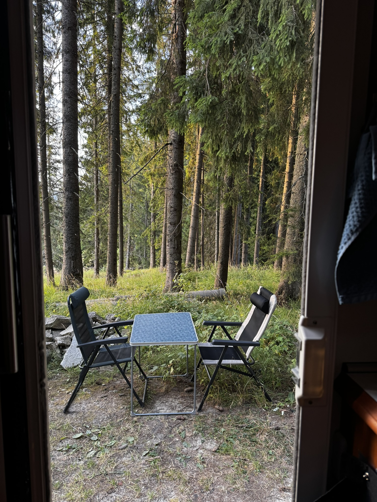
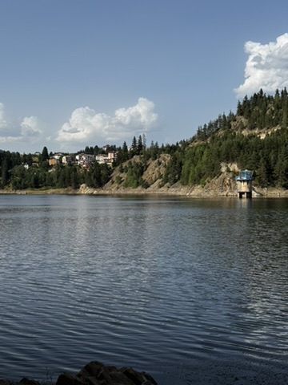

# How I Turned My Raspberry Pi Into a Magic Portal to My Kubernetes Homelab

*Or: How I learned to stop worrying and love subnet routing for my upcoming Rhodope adventure*

Like many homelab enthusiasts, I found myself in that familiar predicament: I had a beautiful Kubernetes cluster humming away at home, but with my planned campervan trip around the breathtaking Rhodope Mountains approaching, I needed a way to stay connected to my digital kingdom. 

Picture this: me, parked somewhere spectacular in the Bulgarian wilderness, surrounded by ancient peaks and pristine nature, following along with Misha's Homelab Tutorials – that man's voice is basically the Morgan Freeman of the homelab world. I could already imagine his heavenly narration guiding me through some complex Kubernetes deployment while I'm literally surrounded by some of the most beautiful mountains in Europe. But there was one tiny problem: accessing my homelab from a van in the middle of nowhere felt about as realistic as getting my cat to contribute to my electricity bill.

Enter my trusty Raspberry Pi 3, which had been collecting dust like a forgotten Tamagotchi. Time to put this little guy to work as my personal gateway to homelab nirvana.


## The Plan: Alpine Linux + Tailscale = Remote Homelab Access

The goal was simple: access my entire home network (and my precious Kubernetes cluster) from anywhere, without turning my router into Swiss cheese with port forwards or setting up a VPN that would make even a network engineer cry.

### Step 1: Installing Alpine Linux (AKA "Why is my boot partition the size of a postage stamp?")

First things first, I needed to get Alpine Linux running on the Pi. Alpine is perfect for this – it's lighter than my wallet after buying more Raspberry Pis and more secure than my password habits.

**The process from my Mac:**
1. Downloaded Alpine Linux ARM64 for Raspberry Pi
2. Discovered my SD card had multiple tiny partitions (because apparently someone thought 68MB was plenty for a boot partition – thanks, previous me)
3. Reformatted the entire SD card: `diskutil eraseDisk FAT32 ALPINE MBR /dev/disk4`
4. Copied Alpine files and booted up

**Pro tip:** When Alpine asks for your keyboard layout and suddenly your keyboard is speaking in numbers and hieroglyphics, remember to type "us" for the layout. Yes, even if it looks like you're summoning ancient spirits on screen.

### Step 2: Tailscale Installation (Or: How I learned that Alpine doesn't believe in sudo)

Getting Tailscale running was surprisingly straightforward, once I remembered that Alpine Linux ships without sudo because apparently we're all trusted adults here.

```bash
# The magic incantation
curl -fsSL https://tailscale.com/install.sh | sh

# Start the service (as root, because Alpine says so)
su -
tailscaled --state=/var/lib/tailscale/tailscaled.state --socket=/var/run/tailscale/tailscaled.sock &
tailscale up
```

After visiting the authentication URL and convincing Tailscale that yes, this dusty Pi really does belong to me, I had my first Tailscale node running.


### Step 3: The Real Magic – Subnet Routing

Here's where things get interesting. Instead of just accessing the Pi itself, I wanted to access my entire home network through it. This is called subnet routing, and it's basically like having a secret tunnel that leads to your entire homelab.

**First, I had to teach my Pi to be a proper router:**

```bash
# Enable IP forwarding (fancy talk for "yes, you can route traffic")
echo 'net.ipv4.ip_forward = 1' >> /etc/sysctl.conf
echo 'net.ipv6.conf.all.forwarding = 1' >> /etc/sysctl.conf
sysctl -p
```

**Then, I told Tailscale about my home network:**

```bash
# Found my actual network (not the one I assumed it was)
ip route show | grep eth0
# Turns out it was 192.168.68.0/24, not 192.168.1.0/24 like I initially thought

# Advertise the correct subnet
tailscale up --advertise-routes=192.168.68.0/24
```

**Finally, the crucial step:** I had to approve these routes in the Tailscale admin interface. This is Tailscale's way of making sure you really, truly want this random Pi to become the gateway to your digital kingdom.

## The Result: Kubernetes Anywhere

Now comes the beautiful part. With my Pi acting as a subnet router, I can access my entire home network from anywhere:

- My Kubernetes dashboard at `192.168.68.100:8080` 
- My NAS at `192.168.68.50`
- My router's admin interface at `192.168.68.1`
- Even that smart light bulb that somehow ended up with an IP address

All of this works seamlessly from any device on my Tailscale network, whether I'm at a coffee shop, airport, or hiding from responsibilities in a different time zone.

**The real test:** I can now run `kubectl` commands against my homelab cluster from my laptop anywhere in the world, as if I were sitting right next to it. No VPN clients, no port forwarding nightmares, no sacrificial offerings to the networking gods required.



## Why This Setup Rocks

1. **Security**: Everything goes through Tailscale's encrypted mesh network. No open ports on my router, no sketchy VPN setups.

2. **Simplicity**: Once it's set up, it just works. My devices automatically connect to each other wherever they are.

3. **Performance**: Direct connections when possible, with automatic fallback to relay servers when needed.

4. **Reliability**: If my Pi goes down, I just lose remote access – my local network keeps working normally.

## The Gotchas (Because there are always gotchas)

- **Testing confusion**: Remember to actually test from a different network. I spent way too long wondering why subnet routing wasn't working while my laptop was sitting on the same network as my Pi. Sometimes the problem is between the keyboard and chair.

- **Alpine quirks**: No sudo by default, different service management, and the occasional "why doesn't this work like Ubuntu?" moment.

- **Status display**: `tailscale status` might not always show the subnet routes even when they're working perfectly. Trust the ping, not the status display.

## Conclusion

What started as a dusty Raspberry Pi is now my reliable gateway to my entire homelab, perfectly timed for my Rhodope Mountains expedition. Whether I'm parked at a scenic overlook learning about Prometheus monitoring from Misha's tutorials, troubleshooting a deployment while watching the sunrise over ancient peaks, or just want to check on my Kubernetes pods while pretending the cellular signal isn't cutting in and out, everything is just a Tailscale connection away.



My homelab is no longer imprisoned behind my router – it's now accessible from anywhere, even from a van surrounded by some of Europe's most stunning wilderness. The thought of following along with Misha's heavenly voice explaining complex networking concepts while I'm literally surrounded by mountains that have stood for millions of years... honestly, it doesn't get much better than that.


*Now if you'll excuse me, I need to go plan my route through the Rhodopes!*

---

## Special Thanks

A huge shoutout to **Misha** for creating such incredible homelab tutorials that make complex topics feel approachable (and for having a voice that could probably make reading the phonebook sound fascinating). And massive thanks to the **Kubecraft community** – you folks are the reason I fell down this homelab rabbit hole in the first place. The knowledge sharing, troubleshooting help, and general enthusiasm for breaking things in the name of learning has been invaluable. Can't wait to be part of the "deployed from a mountaintop" club! 🏔️
